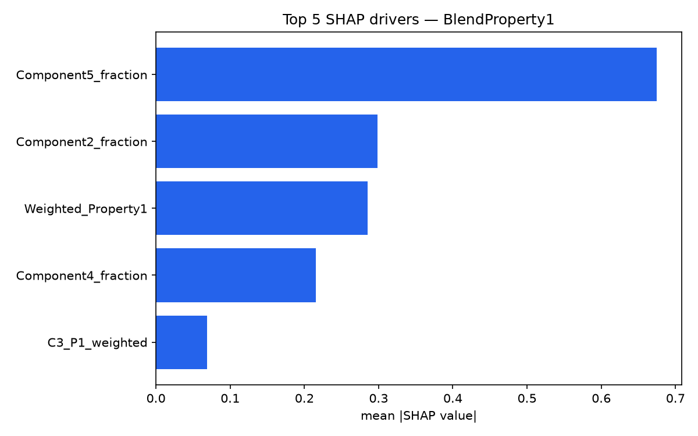

# Benchmarks

Generated by running `model.ipynb` end-to-end (`jupyter nbconvert --to notebook --execute --inplace model.ipynb`)
inside the project's `.venv` (see [README.md](README.md) for setup). 2000 training rows, 461 engineered
features, 80/20 train/val split (`random_state=42`).

## 1. Model comparison (held-out validation set)

CatBoost, XGBoost, and LightGBM trained with matched hyperparameters (500 estimators, depth 6,
learning rate 0.05), each wrapped in `MultiOutputRegressor` over the 10 `BlendProperty` targets.

| Model    | mean MAPE | mean MAE | mean RMSE |
|----------|----------:|---------:|----------:|
| **CatBoost** | 0.774 | **0.1063** | **0.1477** |
| LightGBM | 2.293 | 0.1314 | 0.1764 |
| XGBoost  | 1.900 | 0.1575 | 0.2096 |

**Winner: CatBoost — 16.3% lower RMSE than the runner-up (LightGBM).**

> Note on MAPE: `BlendProperty1-10` are standardized (roughly zero-centered) values, so a
> handful of validation rows have true values very close to 0, which inflates percentage error
> disproportionately. MAPE is reported for completeness, but **RMSE/MAE are the primary metrics**
> for comparing models here.

### CatBoost, per target (validation set)

| Target | MAPE | MAE | RMSE |
|---|---:|---:|---:|
| BlendProperty1  | 1.646 | 0.0766 | 0.1014 |
| BlendProperty2  | 0.395 | 0.0768 | 0.0977 |
| BlendProperty3  | 1.012 | 0.1494 | 0.1904 |
| BlendProperty4  | 0.436 | 0.0811 | 0.1156 |
| BlendProperty5  | 0.383 | 0.0778 | 0.1475 |
| BlendProperty6  | 0.365 | 0.0627 | 0.0958 |
| BlendProperty7  | 0.786 | 0.1488 | 0.1924 |
| BlendProperty8  | 1.282 | 0.1191 | 0.1649 |
| BlendProperty9  | 1.155 | 0.1900 | 0.2558 |
| BlendProperty10 | 0.275 | 0.0811 | 0.1150 |

## 2. SHAP — top drivers per BlendProperty target

`shap.TreeExplainer` run on the winning CatBoost model's per-target estimators, over the
validation set. Top 3 drivers per target (full top-10 is in the notebook output):

| Target | #1 driver | #2 driver | #3 driver |
|---|---|---|---|
| BlendProperty1  | Component5_fraction | Component2_fraction | Weighted_Property1 |
| BlendProperty2  | Component5_fraction | Weighted_Property2 | Component2_fraction |
| BlendProperty3  | Component2_fraction | Weighted_Property7 | Component4_fraction |
| BlendProperty4  | Component5_fraction | Weighted_Property4 | Component2_fraction |
| BlendProperty5  | Component2_fraction | Component2_Property5 | C2_P5_weighted |
| BlendProperty6  | Component5_fraction | Weighted_Property6 | Component2_fraction |
| BlendProperty7  | Component2_fraction | Weighted_Property7 | Component4_fraction |
| BlendProperty8  | Component2_fraction | Component5_fraction | Weighted_Property8 |
| BlendProperty9  | Component5_fraction | C5_P8_weighted | C4_P9_weighted |
| BlendProperty10 | Component4_fraction | Component5_fraction | Component2_fraction |

**Takeaway:** across nearly every target, the raw mixing **fractions** (`Component{2,4,5}_fraction`)
and the fraction-**weighted linear-mixing-rule features** (`Weighted_Property{j}`, `C{i}_P{j}_weighted`)
dominate — not the hundreds of derived statistical features (entropy, rank, z-score, diversity).
Those higher-order features exist in the top 10 for some targets (e.g. `Component2_Property5_diff_mean`
for BlendProperty5) but are consistently secondary to "how much of each component, weighted by its
own property value" — i.e. the model is mostly learning a (mildly nonlinear) version of the classical
linear blending rule, which is the physically expected result for blend properties.

## 3. Test coverage

**24 unit tests** (`pytest -q tests/`, all passing) covering `src/features.py`'s 9 feature-engineering
functions, including the edge cases the raw data can actually produce:
- an all-zero property group (entropy zero-division guard)
- a property group where all 5 components have identical values (std=0 → z-score/CV division-by-near-zero)
- a blend dominated by a single component (`fraction=1` for one component, `0` for the rest)
- mixed-sign and negative property values
- a missing (`NaN`) property value propagating correctly without crashing the pipeline
- a smoke test running the full `build_features` pipeline against 20 real rows from `dataset/train.csv`
